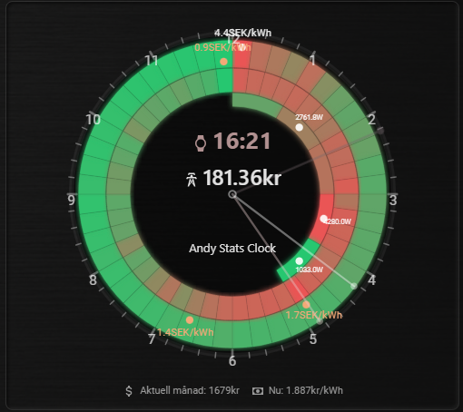
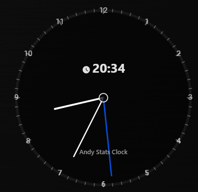

# 📟 Andy Stats Clock – v1.0.6
A next-generation multi-layer radial statistics clock for Home Assistant.
Perfect for visualizing energy prices, consumption, temperature, historical sensor trends, or any numeric entity — all presented in a beautiful 12h/24h circular layout.

This is not just a clock — it’s an interactive, animated, data-driven radial dashboard component






> **Recommended installation method:** HACS  
> Manual installation is supported but not recommended unless HACS is unavailable


🌟 Key Features

✔ Unlimited rings (Layers)
Each ring can be configured independently with:
 * Entity selection
 * Gradients
 * Value intervals (dynamic coloring)
 * Opacity
 * Thickness
 * Radius
 * Min/Max/Average markers
 * Labels + badges
 * 24h or 12h interpretation
 * Automatic history loading for normal sensors
 * Auto-fallback when future values are unknown
 * Keep history of "History / Consumption layers" / fade history / change opacity

✔ Multiple time modes

Supports:
* 24h mode (00–23, full-day representation)
* 12h mode (AM/PM logic with correct data slicing)
The card automatically adjusts all values based on whether the current time is AM or PM.

✔ Three animated clock hands

Each with independent configuration:

⏰ Hour hand
* Follows system time
* Smooth or discrete movement
* Color, width, opacity

🕒 Minute hand

* Full smooth animation
* Color, width, opacity

⏱ Second hand

* Ultra-smooth, continuously animated
* Color, width, opacity
  

All hands can optionally share a central hub, using a configurable style + color.


✔ Auto-history for normal sensors

If a sensor does not expose hourly arrays (like normal temperature/consumption sensors):

The card will:
1. Automatically call Home Assistant history API
2. Build 24 buckets (hours of the day)
3. Fill missing values intelligently
4. Only show valid data (no fake futures)
5. Cache results and avoid overloading HA

✔ CenterWatch (Center display)

Add multiple center elements such as:
* Sensor state
* Time
* Custom text
* Icons
* Dynamic templates (<state>, <unit>, <name>, <time>)

✔ Bottom information / badges

Add any number of bottom items:
* Entities
* Static text
* Icons
* Formatted values

✔ Full visual editor included

No YAML needed.
Features:
* Collapsible menus for cleaner editing
* Clear grouping of Layers / CenterWatch / Bottom
* Fully visual icon pickers
* Live updates
* Safe entity search dropdowns (non-blocking)

✔ Minute ticks / outer markers

Optional visual ticks around the outer ring for precise time alignment.

🧠 Ideal Use Cases

* Energy price visualization (Nordpool / Tibber)
* Electricity consumption patterns
* Heating system temperatures
* Weather metrics over 12/24 hours
* Step counters, presence stats, movement sensors
* Any numeric trend you want to visualize beautifully


## Installation

### Option A — Install via HACS (published repository)
1. Open **HACS** in Home Assistant.
2. Go to **Frontend**.
3. Search for **Andy Stats Clock**.
4. Open the card and click **Download**.
5. Restart Home Assistant (or reload frontend resources).

After installation, the Lovelace resource is usually added automatically by HACS.  
If not, see **“Add as a resource”** below.

---

### Option B — Install via HACS (custom repository)
Use this method if the card is not yet listed in the HACS store.

1. Open **HACS** in Home Assistant.
2. Click the **⋮ (three dots)** menu in the top right.
3. Select **Custom repositories**.
4. Add the repository:
   - **Repository**: `https://github.com/maglerod/andy-stats-clock`
   - **Category**: **Lovelace**
5. Click **Add**.
6. Go to **Frontend** in HACS.
7. Search for **Andy Stats Clock**.
8. Click **Download**.
9. Restart Home Assistant (or reload frontend resources).

---

### Option C — Manual installation (no HACS)
1. Download `andy-stats-clock.js` from this repository.
2. Copy the file to your Home Assistant configuration directory: /config/www/andy-stats-clock.js

### Add as a resource (if needed)
If the card does not appear automatically:

1. Go to **Settings → Dashboards → Resources**
2. Click **Add Resource**
3. Enter:
- **URL**: `/local/andy-stats-clock.js?v=20260101-101`
- **Resource type**: `JavaScript Module`
4. Save and perform a **hard refresh** in your browser (`Ctrl+F5` / `Cmd+Shift+R`).

---

### Add the card to a dashboard

#### Using the UI editor
1. Open your dashboard → **Edit dashboard**
2. Click **Add card**
3. Search for **Andy Stats Clock**
4. Configure the card and save


#### Using YAML
```yaml
type: custom:andy-stats-clock
clock_mode: 24h
show_hour_labels: true
layers:
  - id: price_today
    type: price
    entity: sensor.nordpool_kwh_se3_sek_3_10_025
    price_source: array
    attribute: today
    thickness: 8
    color_mode: intervals
center_layers:
  - id: main
    type: entity
    entity: sensor.time
bottom_layers:
  - id: price
    type: entity
    entity: sensor.nordpool_kwh_se3_sek_3_10_025
```

## ☕ Support the project 
I’m a Home Automation enthusiast who spends way too many late nights building custom cards, dashboards and small tools for Home Assistant.
I love creating clean, useful UI components and sharing them for free with the community, and I try to help others whenever I can with ideas, code and support.
If you enjoy my work or use any of my cards in your setup, your support means a lot and helps me keep experimenting, improving and maintaining everything.

<a href="https://www.buymeacoffee.com/AndyBonde" target="_blank">
  
</a>


